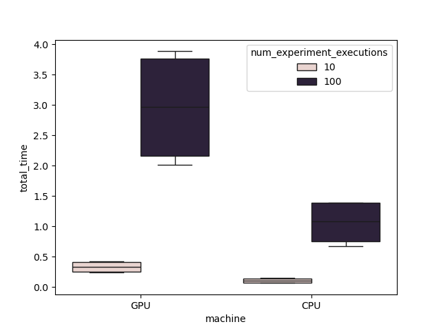

# Introduction to GPU computing with Simulating Annealing and Metropolis-Hastings algorithm

## Getting started
`cd` into the repo directory, then using conda run the following command:

```{commandline}
conda env create --file environment.yml
```
This will create a conda enviorment called `intro-gpu-sa-metropolis`.
Activate this envoirment with the following command:
```commandline
conda activate intro-gpu-sa-metropolis
```
You should be set to run the time experiment
```commandline
python experiment.py
```
This will output a single box plot of the execution times for experiments on the GPU versus CPU.



## Goal 
For a fixed matrix $W$ $\in$ $\mathbb{R}^{m \times n}$ and vector $Y$ $\in \mathbb{R}^{m}$, we want infer $x$ $\in$ $\{-1,1\}^{n}$ for the following model:

```math
Y = \frac{1}{n}ReLU(Wx).
```

We will formulate this problem as an optimization problem using [simulated annealing](https://en.wikipedia.org/wiki/Simulated_annealing) that uses a Metropolis step to target the following [Gibbs-Boltzman](https://en.wikipedia.org/wiki/Boltzmann_distribution) distribution:
$$
p_Y(x) = \frac{1}{Z_{\beta}} * \exp(-\beta H_{Y}(x))
$$
where 
$$
H_{Y}(x) = \sum_{m}(Y_{m} - \hat{y}_{m})^{2}
$$
will be refered to as the energy.

### Metropolis Algorithm 
Calculating the MH ratio largely simplifies to calculating the difference between the energy of the two states.

$$
\Delta_{ij} = H_{Y}(x_{j}) - H_{Y}(x_{i})
$$

$$
p_{accept}
= 
\min \Big(1, e^{\Delta_{ij}} \Big)
$$